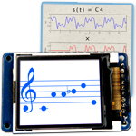

# arduino-pitch_detector  
## Pitch Detection on Arduino using Autocorrelation

While playing my clarinet, I realized that it would be fun to hear other instruments playing alongside me. Instruments like guitar, piano or even a choir. It would also be nice if the melodies could be transcribed on paper. All existing solutions to these problems require a bulky computer or a cell phone. I realized that creating this compact device would combine my interest for music with my passion for engineering and math.

This project creates a small, affordable and accurate device that listens to a musical instrument and recognizes the notes played. These notes can then be sent to a synthesizer in the common MIDI format. This allows musician to hear other instruments playing alongside with them, and allows them store their compositions.
The implementation is in C++ and uses an Arduino UNO, breadboard, microphone and optional display.  It displays the music as a piano roll and sends it to an external synthesizer.

The implementation is in C++ and uses an Arduino, breadboard, microphone and display.  It changes the sound wave to an electrical signal; uses autocorrelation to find frequency played; display frequency as note on screen while sending to a MIDI synthesizer.

Continue reading at [http://www.coertvonk.com/technology/embedded/arduino-pitch-detector-13252](http://www.coertvonk.com/technology/embedded/arduino-pitch-detector-13252)

(c) Copyright 2015-2016, Johan Vonk
