# MIDImike

[](https://github.com/johanvonk/Arduino_Pitch-Detector/discussions)


While playing my clarinet, I realized that it would be fun to hear other instruments, such as a guitar, piano or even a choir ensemble playing alongside me! It would be equally nice to be able to have these melodies transcribed on paper or electronically. All existing solutions to these problems required a bulky computer or a cell phone, whereas creating this compact device would combine my interest for music with my passion for engineering and math to create something useful!

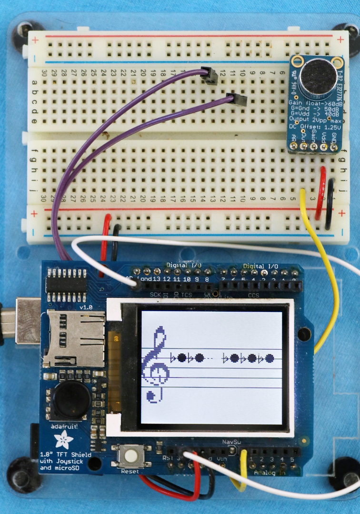

This project allows you to create a small, affordable, and accurate device that listens to a musical instrument and recognizes the notes played. It displays the music on a clef or as piano roll. These notes can then be sent to a synthesizer using the MIDI protocol. This allows musicians to hear other instruments playing alongside with them, and also allows them store their compositions.

A short video of an early prototype

[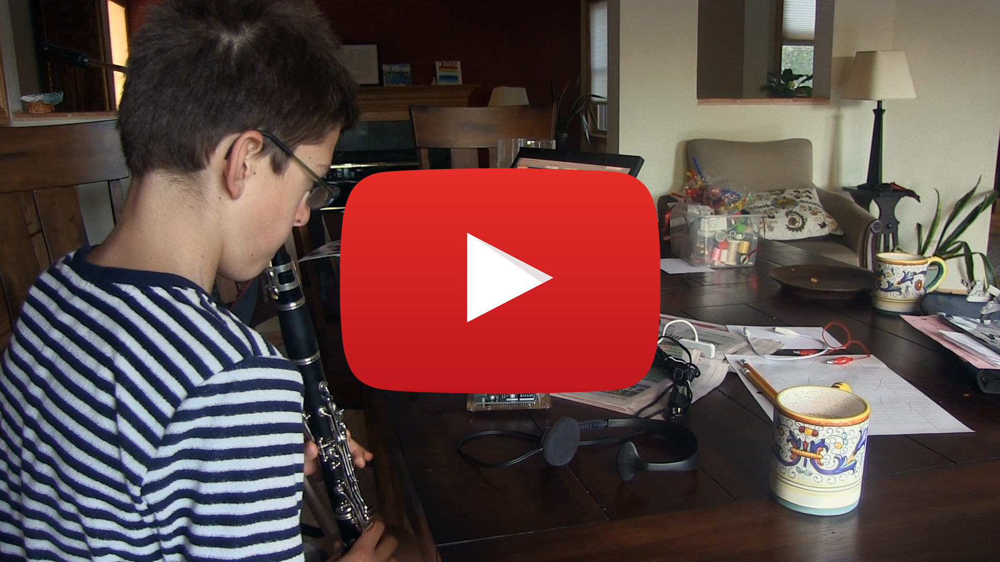](https://www.youtube.com/embed/W_s_MojYlSE)

## Clone

We'll start by cloning the repository and its submodules to a local directory. The `--recursive` flag automatically initializes and updates the submodules in the repository.

```bash
git clone --recursive https://github.com/jvonk/Arduino_Pitch-Detector.git
```

or using `ssh`

```bash
git clone --recursive git@github.com:jvonk/Arduino_Pitch-Detector.git
```

## Hardware

This project uses inputs from an amplified microphone and outputs them, after processing, to a TFT display and USB-MIDI connection. To use the optional USB-MIDI output, you will need to replace the firmware on the ATmega16U2 companion chip.

### Schematic

Power


Logic

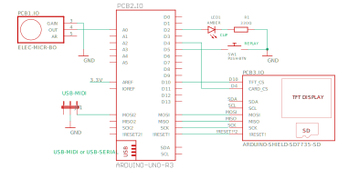

A few notes:

- When lit, `LED1` indicates that the signal exceeds the maximum level.
- When connected, `JP1` selects the USB-MIDI output. Otherwise, USB-SERIAL is selected. To upload the sketch, this jumper needs to be open, and the Arduino power must be cycled.
- Push button, `SW1` was used during development to replay stored MIDI notes.
- Switch `SW2`, is for a future extension that corrects the pitch for transposing instruments.

> Remember to connect the 3.3 Volt output from the Arduino to the `AREF` input on the Arduino. Without this, no notes will be displayed.

### Board

This is totally overkill, but the `.brd` file can be found the in `hardware` directory.

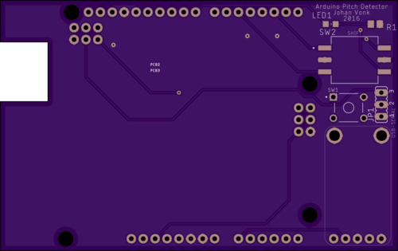
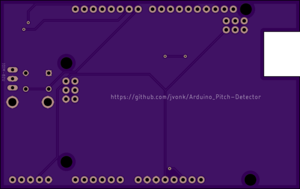

Note that the footprint of `PCB1` is mirrored, and `MISO2` and `MOSI2` should be connected in rev 1 of the board. These problems are corrected in rev 2.

### Bill of materials

| Name | Description                                        | Suggested mfr and part#   |                                                                                                      Paid |
| ---- | -------------------------------------------------- | ------------------------- | --------------------------------------------------------------------------------------------------------: |
| PCB1 | Electret microphone w/ auto gain control           | Adafruit 1713             |  [$7.95](https://www.adafruit.com/product/1713) |
| PCB2 | Arduino Uno R3 or Arduino METRO 328                | Adafruit 2488             | [$17.50](https://www.adafruit.com/product/2488) |
| PCB3 | ST7735R 1.8" Color TFT display w/ MicroSD breakout | Adafruit 802              | [$19.95](https://www.adafruit.com/product/802) |
| HDR  | Shield stacking headers for Arduino                | Adafruit 85               |  [$1.95](https://www.digikey.com/en/products/detail/adafruit-industries-llc/85/5154649)
| LED1 | LED, Amber Clear 602nm, 1206                       | Lite-On LTST-C150AKT      |  [$0.33](https://www.digikey.com/en/products/detail/lite-on-inc/LTST-C150AKT/269213) |
| R1   | Resistor, 330 Ω, 1/8 W, 0805                       | YAGEO RC0805FR-0768RL     |  [$0.10](https://www.digikey.com/en/products/detail/yageo/RC0805FR-07330RL/727866) |
| JP1  | Connector header, vertical 3 pos, 2.54mm           | Metz Connect PR20203VBNN  |  [$0.10](https://www.digikey.com/en/products/detail/metz-connect-usa-inc/PR20203VBNN/7794768) |
| SW1  | Switch tactile, SPST-NO, 0.05A/24V                 | TE Connectivity 1825910-3 |  [$0.15](https://www.digikey.com/en/products/detail/te-connectivity-alcoswitch-switches/1825910-3/2400476) |
| SW2  | Switch rotary dip BDC comp, 100mA/5V               | Nidec Copal SH-7030TB     |  [$2.00](https://www.digikey.com/en/products/detail/nidec-copal-electronics/SH-7030TB/2057869) |

### Notes

For the microphone, I use the Adafruit microphone breakout, because it has a 1.25 Volt DC bias and includes an automatic gain control. The "max gain" is set to 40 dB by connecting the `GAIN` to `5V`. Other microphones will work for as long as they have a DC biased output, and the output signal is strong enough.

The popular Arduino UNO R3 forms the heart of the system. Note that the REPLAY signal was only used during debugging. This board is now becoming hard to find, so you can also use the Arduino METRO 328 or possibly other boards instead.

If you’re going to reprogram the `Atmega16u2`, you need access the companion chip header (ICSP1) as marked in the illustration below.

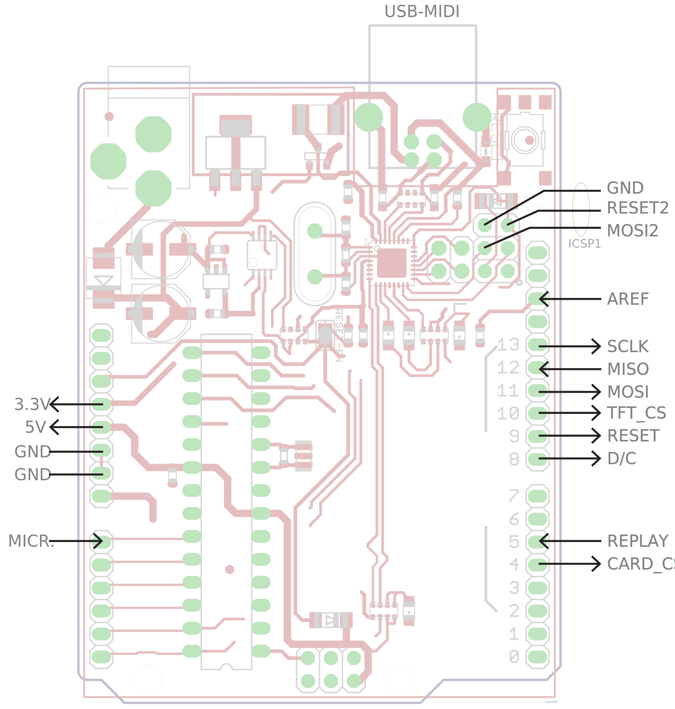

## Software

The software on the Arduino transforms the sound wave to an electrical signal, uses autocorrelation to find the frequency played, and then displays the frequency as note onscreen, in addition to outputting it to a MIDI synthesizer.

### Requirements

| Component                          | Version tested       |
| ---------------------------------- | -------------------- |
| Arduino IDE                        | 1.8.19 (&ge; 1.6.12) |
| Arduino AVR Boards                 | 1.8.5 (&ge; 1.6.14)  |
| Bill Greiman SdFat library         | 2.1.2                |
| Adafruit BusIO library             | 1.11.5               |
| Adafruit ST7735 and ST7789 library | 1.9.3                |
| Adafruit GFX Library               | 1.11.0               |

### Build

- Install the libraries.
- If switch `SW1` is closed, open it and power-cycle the device.
- Using the Arduino IDE or Visual Code
  - Specify the board, COM port and baud rate.
  - Build and upload the sketch .

By default the USB port is used for USB-MIDI, so monitoring the serial port will not show anything of use.

The device is now ready to show the pitch of notes played!

If you want to connect it using USB-MIDI, continue reading.

## USB-MIDI

> Instructions below are for / tested on Windows, but should equally apply to Linix and MacOS;

The USB on the Arduino talks USB-SERIAL with the host computer. That is how the Serial.print() statements end up on the serial monitor. A small companion chip (ATmega16U2) on the Arduino acts a UART/USB-serial bridge.

We reprogram this companion chip on the Arduino UNO R3 such that, when `SW1` is closed and you power-cycle the device, it appears as a MIDI peripheral (HID), or alternatively as the usual USB-SERIAL port.

It is important that the Arduino can still behave as USB-SERIAL device, because this is the usual method of uploading new sketches.

### Match the USB IDs

I patched dualMocoLUFA, so that it matches what is reported by Windows Device Manager's detail `hardware Ids`.

```
USB\VID_2341&PID_0043&REV_0001
```

If your device shows different details, read [dualMocoLUFA/PATCHES.md](dualMocoLUFA/PATCHES.md) first.

### Install

To install the modified dualMocoLUFA firmware on the ATmega16U2m:

- Install the [Atmel FLexible In-system Programmer](https://www.microchip.com/en-us/development-tool/flip) (FLIP).

- Put the Arduino Uno R3 in DFU mode by briefly connecting the `RESET2*` to `GND` on the atmega16u2 ICSP1 header. These are the leftmost pins, near the USB connector, as shown above.

- In Windows Device Manager, it should show up as “Atmel USB Devices > ATmega16U2“. If it shows up as "Unknown device", install the driver from `U:\Program Files (x86)\Atmel\Flip 3.4.7\usb\atmel_usb_dfu.inf`.

- Start Atmel FLIP
  - Device » Select » `ATmega16U2`
  - Settings » Communication » `USB`
  - File » Load HEX File » `dualMocoLUFA/LUFA-100807-patched/Projects/dualMoco.hex`

### Connect

At this point you should be able to connect the Arduino to a computer and see MIDI events using e.g. MidiView

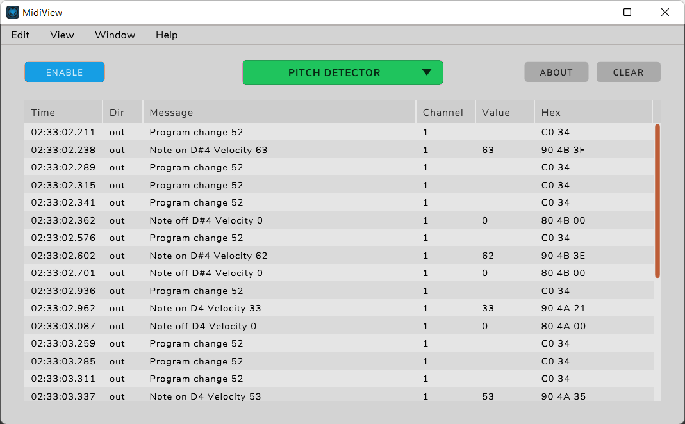

If you have a real synthesizer to connect to, you can try that. Otherwise, I suggest installing a software synthesizer such as

- [CoolSoft MIDIMapper and VirtualMIDISynth](https://coolsoft.altervista.org/en/virtualmidisynth) with sound fonts [FluidR3 GM](https://github.com/urish/cinto/blob/master/media/FluidR3%20GM.sf2) and/or [Timbres of Heaven](http://midkar.com/soundfonts/index.html).

There are many [Software MIDI editors and sequencers](https://en.wikipedia.org/wiki/Comparison_of_MIDI_editors_and_sequencers) to choose from. A few that I tried are:

- [MidiEditor](https://www.midieditor.org/), free. Can record. (Press the "Connect Midi In/Out" button.)
- [MuseScore](https://musescore.org/en), free.
- [Anvil Studio](https://www.anvilstudio.com/), freemium. Can record.
- [Cakewalk](http://www.cakewalk.com/)
- [ScoreCloud](https://scorecloud.com/), freemium; requires sign-in.
- [Presonus Notation](https://www.presonus.com/products/notion), commercial

### Demo

Here's a video recording of the Arduino's MIDI output with SoundCloud. The clarinet excerpt is performed by the U.S. Army Field Band.

[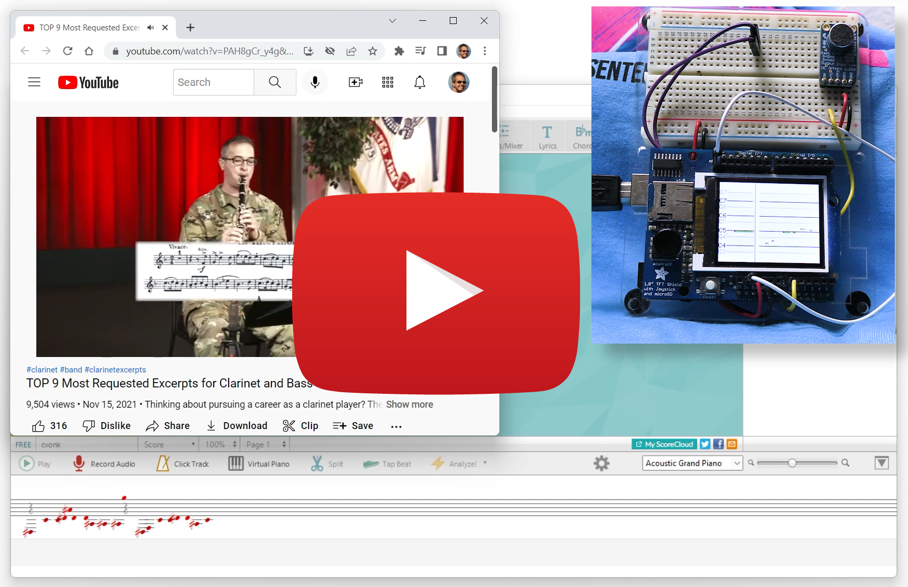](https://www.youtube.com/watch?v=OqM9_WET5q0&ab_channel=CoertVonk)

## Configuration options

The file `config.h` is used to configure the device.

### SRC

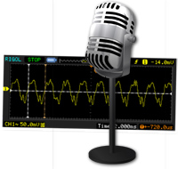

| SRC        | Description                                  |
| ---------- | -------------------------------------------- |
| `SRC_MIC`  | Uses the sound from the attached microphone. |
| `SRC_FILE` | Reads the sound from files on SD card.       |

### DST


| DST             | Description                                                                                                                                    |
| --------------- | ---------------------------------------------------------------------------------------------------------------------------------------------- |
| `DST_STAFF`     | Displays the output of the frequency and pitch detection module on a scrolling G-clef staff.                                                   |
| `DST_PIANOROLL` | Will show the notes and durations on a piano roll.                                                                                             |
| `DST_TEXT`      | Displays the output of the frequency and pitch detection module in a table format on the serial monitor, which can be useful for verification. |

### USB

Configures the USB protocol used. After changing to USB-MIDI, connect MISO2 to GND and power cycle the Arduino board

| SRC          | Description                                                                                                                           |
| ------------ | ------------------------------------------------------------------------------------------------------------------------------------- |
| `USB_MIDI`   | Transmits note events using the USB-MIDI protocol at 31250 baud. Requires `DST_PIANOROLL` so the note segmentation algorighm can run. |
| `USB_SERIAL` | Transmits text using the usual USB-SERIAL protocol at 115200.                                                                         |

## Verification

The testing methodology reflects the three design criteria.

- To test the frequency and pitch detection, I used monophonic samples.
- For note level segmentation, I used commercial solo clarinet recordings.
- To measure the delay between the note being played and it being recognized, I edited the code, adding a timer to measure the delay between audio input and MIDI output.

Instead of taking input from the microphone, the audio samples are read from files on a micro-SD card. The module sddir.cpp expects top level directories `notes` and `solos`. The next level of directories should have the name of the sample rate (e.g. 9615). From there it will recurse the subdirectories and open each `.wav` file.

The pitch detection and note level segmentation algorithms can be tested independently.

### Pitch

To test the frequency and pitch detection, I used clarinet and monophonic piano samples from the University of [Iowa Electronic Music Studios](https://theremin.music.uiowa.edu/index.html). The measured frequencies were written to the serial monitor, and imported into a spreadsheet for evaluation.

#### B♭ Clarinet

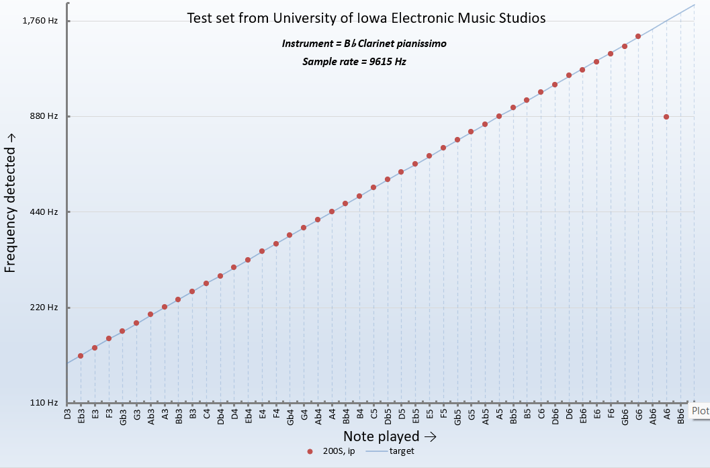

#### Piano

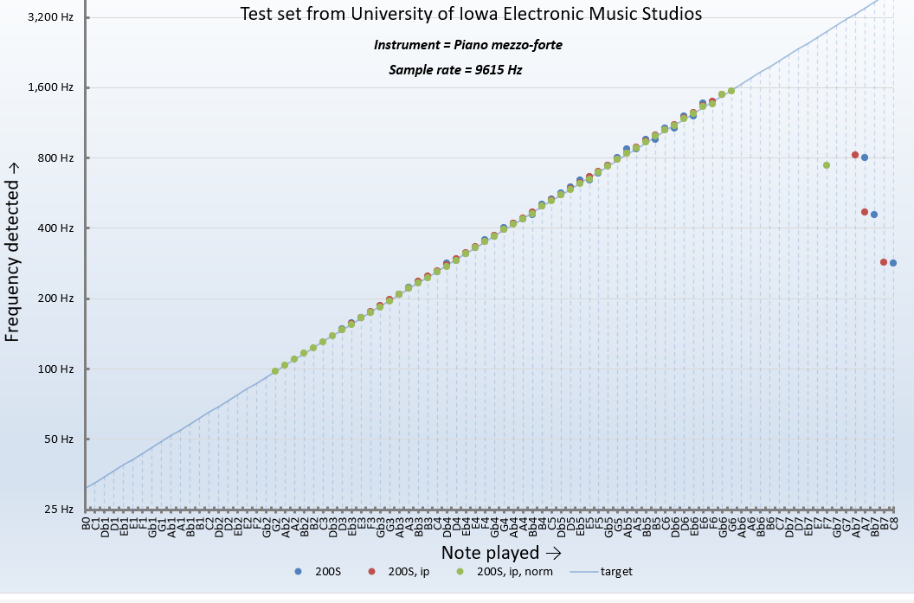

#### B♭ Trumpet


#### E♭ Alto Saxophone

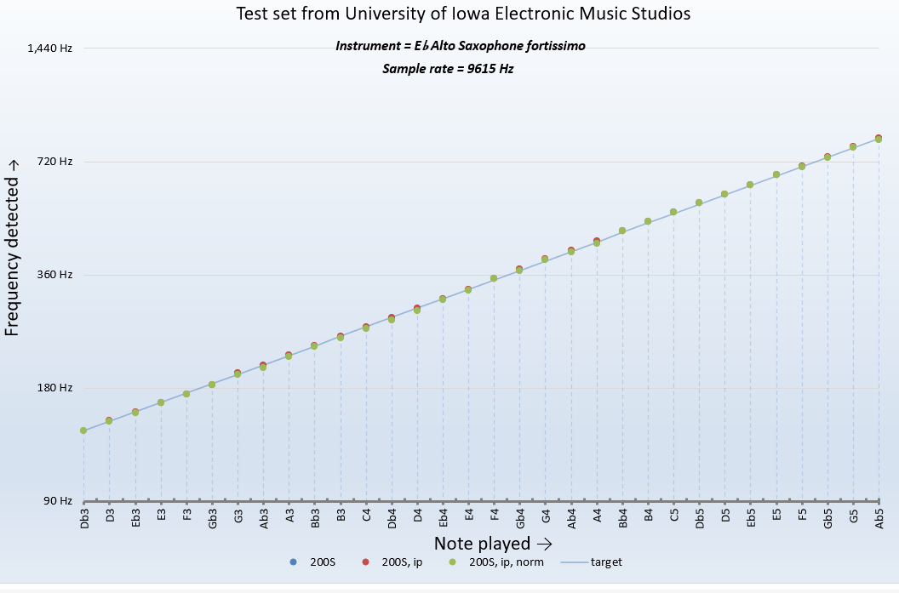

### Note level segmentation

The algorithm is considered correct, when it tracks the pitch correctly and the melody of the original file has not been modified.

I used various solo clarinet recordings:

- Ernesto Molinari, Charme (pour clarinette)
- Sean Osborn, A Set for Clarinet Allegro
- Sean Osborn, A Set for Clarinet Adagio
- Traditions of Excellence, book 1, page 38, exercise 4 on DVD

Another choice could have been:

- Monophonic music segmentation dataset (CMMSD) [^1]
  A new data set with annotations for monophonic audio excerpts. Annotations for note (steady state, sustain), transition (transient, release), and rest (silence, noise, reverberation). The data set consists of 36 items, excerpts of commercial recordings of solo performances of classical music. It covers the instruments bass, bassoon, cello, flute, horn, oboe, trombone, trumpet, and violin, and spans several periods of time in history.

[^1]: Henrik von Coler (Technische Universität Berlin) and Alexander Lerch (Georgia Institute of Technology), January 2014, [Proceedings of the AES 53rd International Conference on Semantic Audio](https://www.researchgate.net/publication/260000033_CMMSD_A_Data_Set_for_Note-Level_Segmentation_of_Monophonic_Music)

To verify, I compared the generated MIDI piano roll to the original score, and the synthesized MIDI events to the original performance.

## Design document

More information on the design and implementation can be found [here](https://coertvonk.com/category/sw/arduino/pitch-detector).
