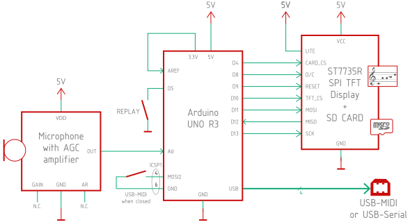

# arduino-pitch_detector

## Pitch Detection on Arduino using Autocorrelation

While playing my clarinet, I realized that it would be fun to hear other instruments playing alongside me. Instruments like guitar, piano or even a choir. It would also be nice if the melodies could be transcribed on paper. All existing solutions to these problems require a bulky computer or a cell phone. I realized that creating this compact device would combine my interest for music with my passion for engineering and math.

This project creates a small, affordable and accurate device that listens to a musical instrument and recognizes the notes played. It displays the music as a a clef or piano roll. These notes can then be sent to a synthesizer using MIDI. This allows musician to hear other instruments playing alongside with them, and allows them store their compositions.

A short video of an early prototype

## Hardware

This project uses input from amplified microphone and outputs to a TFT display and USB-MIDI connection. To use the optional USB-MIDI output, you need to replace the firmware on the ATmega16U2 companion chip as described on the page [Sending MIDI Events](https://coertvonk.com/sw/arduino/pitch-detector/sending-midi-events-31581).

### Schematic

To upload the sketch, the USB-MIDI switch needs to be open. The replay button was used during development to replay stored MIDI notes.

> Remember to connect the 3.3 Volt output from the Arduino to the `AREF` input on the Arduino. If you forget this, no notes will be displayed.

### Bill of materials

| Name | Description | Suggested mfr and part# | Paid |
|------|-------------|-------------------------|-----:|
| MICROPHONE | Electret microphone w/ auto gain control | Adafruit 1713 | [$7.95](https://www.adafruit.com/product/1713)
| ARDUINO    | Arduino METRO 328, or Arduino Uno R3 |  Adafruit 2488 | [$17.50](https://www.adafruit.com/product/2488)
| ST7735R | ST7735R 1.8" Color TFT display w/ MicroSD breakout | Adafruit 358 | [$19.95](https://www.adafruit.com/product/358)

### Notes

For the microphone, I use the Adafruit microphone breakout. because it has a 1.25 Volt DC bias and includes an automatic gain control. Other microphones will work for as long as they have a DC biased output, and the output signal is strong enough.

The popular Arduino UNO R3 forms the heart of the system. Note that the REPLAY signal was only used during debugging. This board is now getting hard to find, but you can also use the Arduino METRO 328 or possibly other boards.

If you’re going to reprogramming the Atmega16u2, you need access the companion chip header (ICSP1) as marked in the illustration below.

## Software

The implementation is in C++ and uses an Arduino, breadboard, microphone and display.  It changes the sound wave to an electrical signal; uses autocorrelation to find frequency played; display frequency as note on screen while sending to a MIDI synthesizer.

### Requirements

| Component | Version tested |
|-----------|----------------|
| Arduino AVR Boards | 1.8.5 (and 1.6.14)
| Arduino IDE | 1.8.19 (and 1.6.12)
| Adafruit BusIO library | 1.11.5
| Adafruit ST7735 and ST7789 library | 1.9.3
| Adafruit GFX Library | 1.11.0

## Design document

Information on the design and implementation can be found at [here](https://coertvonk.com/category/sw/arduino/pitch-detector).
